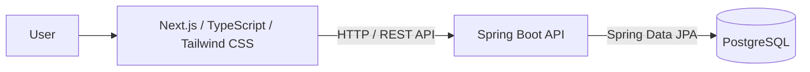
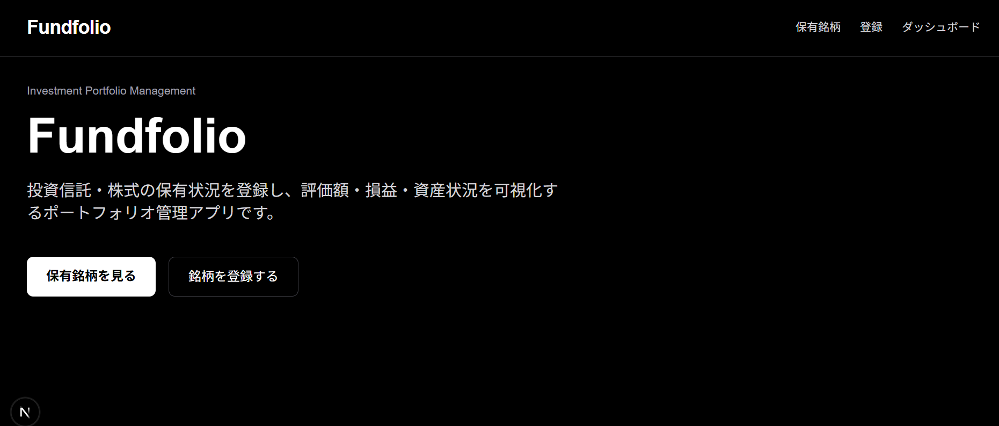
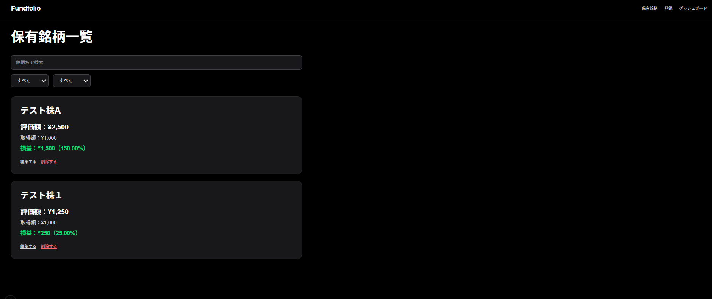
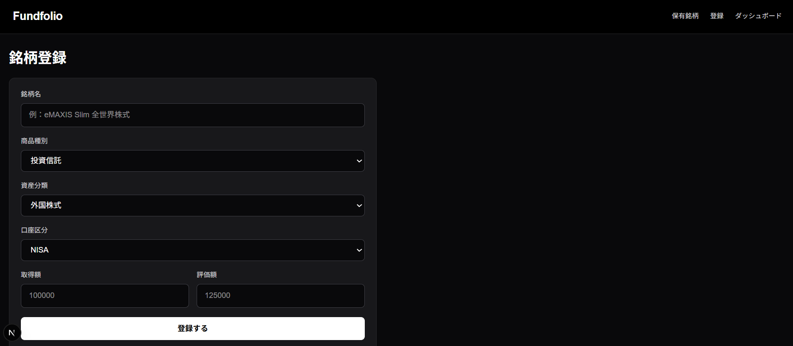
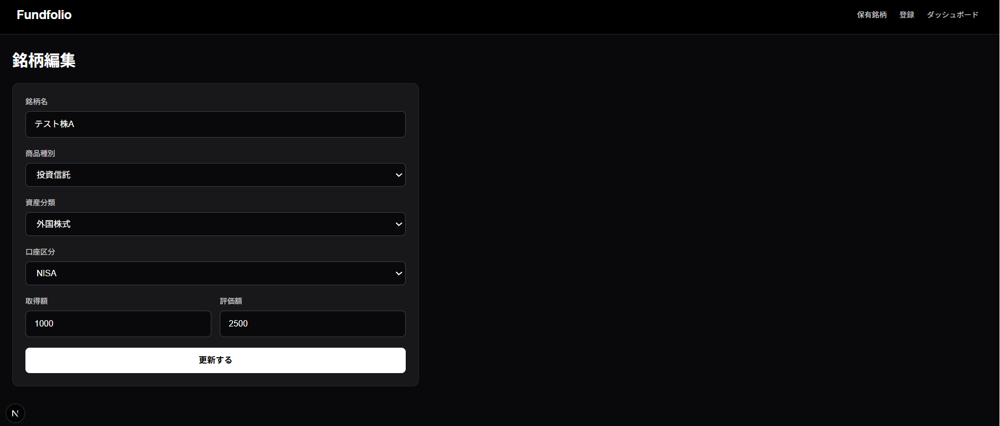
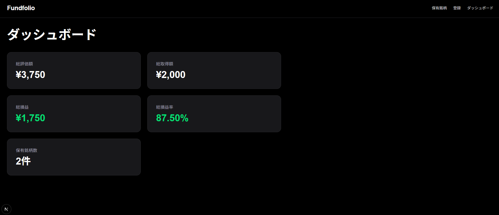
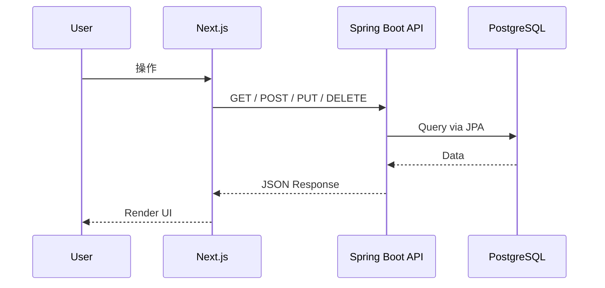

# Fundfolio

投資信託・株式の保有状況を管理し、評価額・損益・資産状況を可視化するポートフォリオ管理アプリです。

## Features

- 保有銘柄の登録
- 保有銘柄の一覧表示
- 保有銘柄の編集
- 保有銘柄の削除
- 銘柄名検索
- 商品種別・口座区分フィルタ
- 評価額・取得額・損益の表示
- ポートフォリオ集計ダッシュボード

## Tech Stack

### Frontend
- Next.js
- TypeScript
- Tailwind CSS

### Backend
- Java
- Spring Boot
- Spring Data JPA

### Database
- PostgreSQL

## Architecture



## API Endpoints

| Method | Endpoint        | Description |
| ------ | --------------- | ----------- |
| GET    | /api/funds      | 保有銘柄一覧取得    |
| GET    | /api/funds/{id} | 保有銘柄詳細取得    |
| POST   | /api/funds      | 保有銘柄登録      |
| PUT    | /api/funds/{id} | 保有銘柄更新      |
| DELETE | /api/funds/{id} | 保有銘柄削除      |

## Setup

### Frontend

```bash
cd frontend
npm install
npm run dev
```

### Backend

```bash
cd backend
./gradlew bootRun
```

### Database

PostgreSQLで以下のDBを作成します。

```sql
CREATE DATABASE fundfolio;
```

## Screenshots

### Top


### Funds List


### New Fund


### Edit Fund


### Dashboard


---

# API Design

## Fund API

### GET /api/funds
保有銘柄一覧を取得する。

### GET /api/funds/{id}
指定したIDの保有銘柄を取得する。

### POST /api/funds
保有銘柄を新規登録する。

### PUT /api/funds/{id}
指定したIDの保有銘柄を更新する。

### DELETE /api/funds/{id}
指定したIDの保有銘柄を削除する。

## API Architecture

