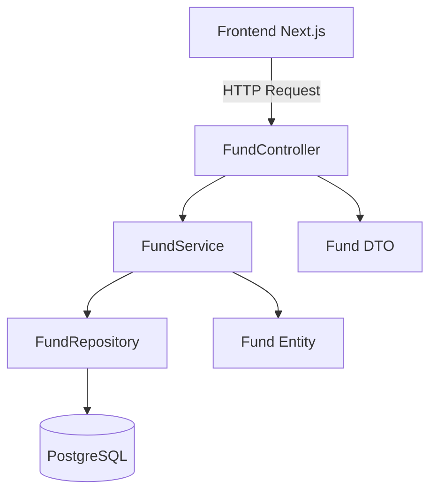

```mermaid
flowchart TD

    A[Frontend Next.js]

    B[FundController]
    C[FundService]
    D[FundRepository]
    E[(PostgreSQL)]

    F[Fund Entity]
    G[Fund DTO]

    A -->|HTTP Request| B

    B --> C

    C --> D

    D --> E

    C --> F

    B --> G
```